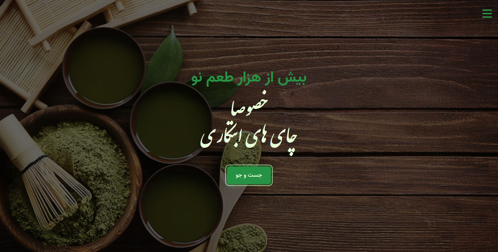

# Intro

## John Smilga

This repository is a practice project that all of it's learning/creating process has covered by [John Smilga](https://www.udemy.com/user/janis-smilga-3/) in this huge [Udemy Course](https://www.udemy.com/course/in-depth-html-css-course-build-responsive-websites/).\
I specially thank him for teaching me how to learn frontend and getting deep in concepts and he was the best teacher of mine.\
I put other links from him over here for more if you want to know him better:\
   

<h2 style="clear: both;">Tea Project</h2>

This project is the first project that is gonna teach me how to use `html`, `css` in a real life after learning the concepts and common tags and properties.

## Used Fonts
I used some open source Persian, English fonts and these are the list of them:
1. [samim-font](https://github.com/rastikerdar/samim-font)
2. [vazir-font](https://github.com/rastikerdar/vazir-font)
3. [IranNastaliq-font](https://github.com/font-store/font-IranNastaliq)
## Demo

This is the demo of the output for the project.
